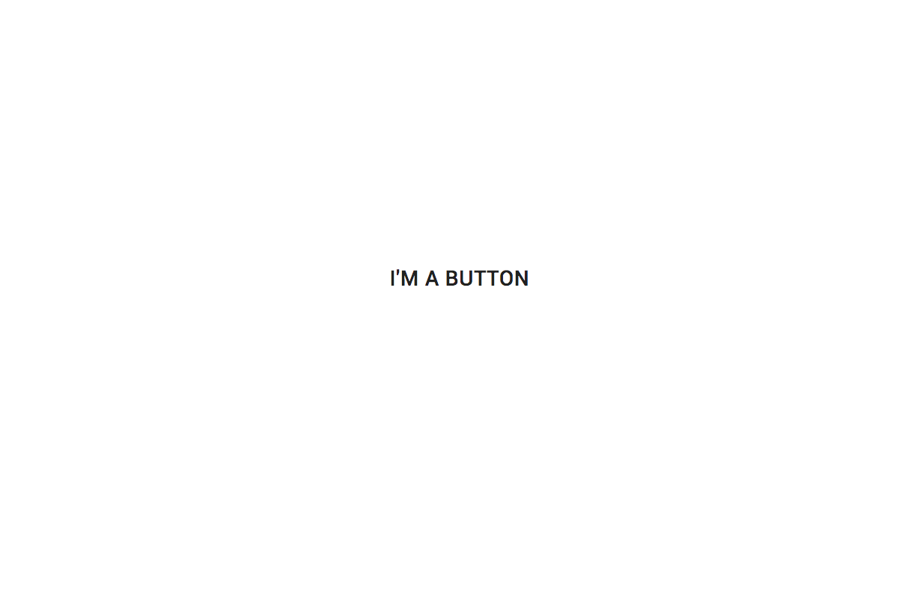
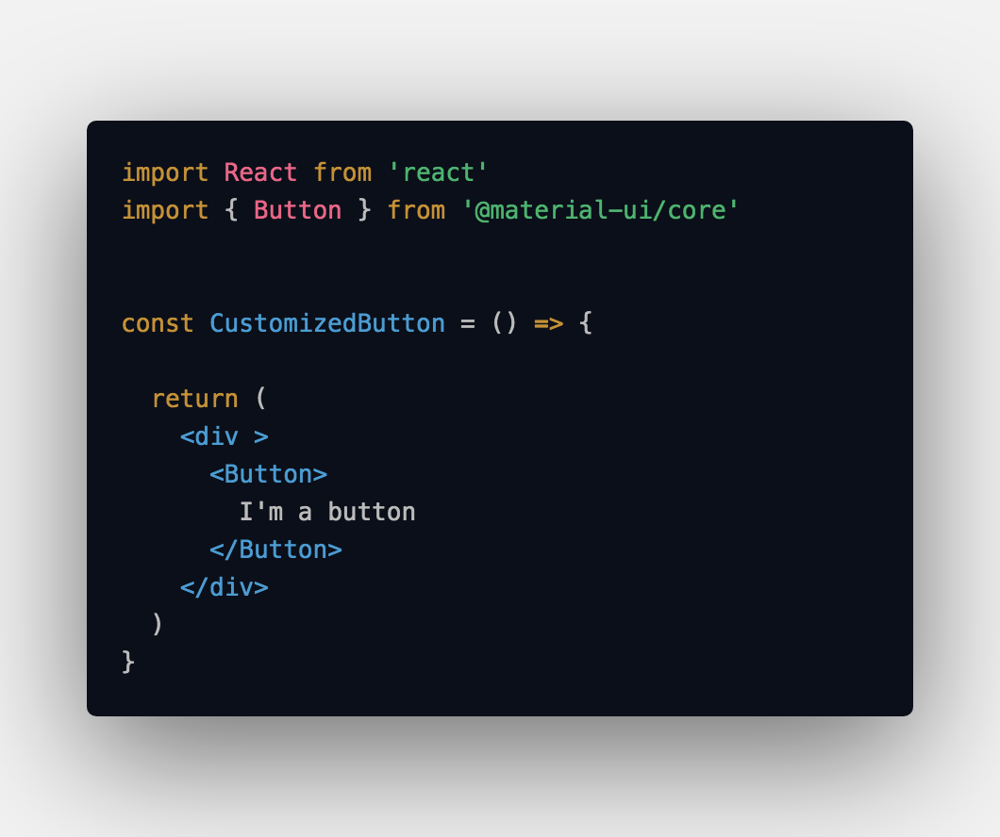

If, like me, you're a developer who appreciates good design choices, the Material UI React library is probably something you're interested in using, if you haven't used it already.

## Getting Started with Material UI (if you haven't already)

If you've never used the Material UI library for React, here's how you get up and running.

`npm i @material-ui/core`

Then, in you're component files, you can import whichever MUI components you'd like via tree shaking.

`import { Button } from '@material-ui/core'`

Now you can use those components in your React code.

## Why You'll Want to Use Custom Styles

Early on when using Material UI components, you'll probably want to add custom styling. Without custom styling, Material UI components are basically just the components that you interact everyday when using Google software.

For example, here is a material UI button, imported and used without styling.

Here is the same button (still without styling) when the user hovers.

Here is the code you would use in order to use the Material UI button component.

## Adding Custom Styles

Let's say that we want our plain old Google button to look like this instead:

And we want it to look like this on hover:

There a few different ways of doing this. [Here is Material UI's own guide](https://material-ui.com/styles/basics/) on the different ways of styling their components.

All of the different approaches serve their purpose. If you're working on a large application throughout which you want to use thematic styling, using the `withStyles` API is a good approach. `withStyles` is a higher-order function that passes your classes via props to the component that you pass to the function ultimately returned by it. This way, you can pass styles a root components, and then have that root component pass the classes down to its children. 

If you prefer using styles components in your project, Material UI has a `styled` API, which is a function to which you pass the components that you want to style.

I think the easiest custom styling approach to get it started with is using the `makeStyles` API. This allow you to use the Material UI components directly in your JSS and to style them right there in the same code location. 

## makeStyles: A Simple Custom Styling Approach

To use the `makeStyles` API, first we've gotta import it.

`makeStyles` takes as an arguments an object that contains JSS. We'll call store the result of this function in a variable called `useStyles`, according to convention.

`useStyles` is itself a functon that will return the classes we can use in our code. So, inside the function that return ours JSX, let's call `useStyles` and store the result in a variable called `classes`.

Now all we have to do is apply the styles that we wrote to our button component, which we can do like this:

Bada-bing, bada-boom. Now we have our custom styles.

## Conclusion

There's infinitely more you can do with the Material UI style APIs then I've shown you here. But hopefully I've helped at least a little bit to demystify them for you.
