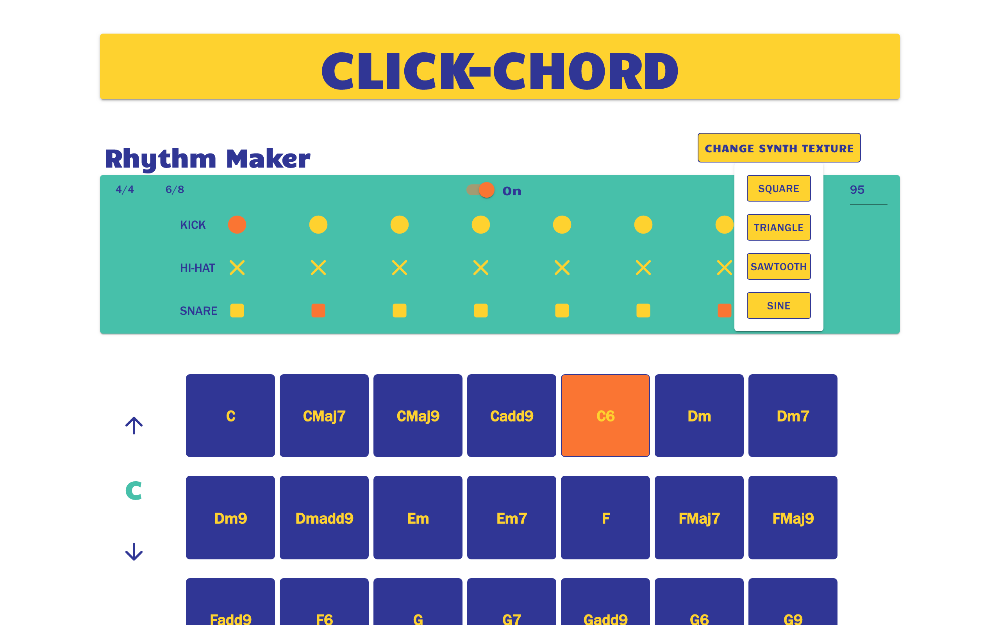
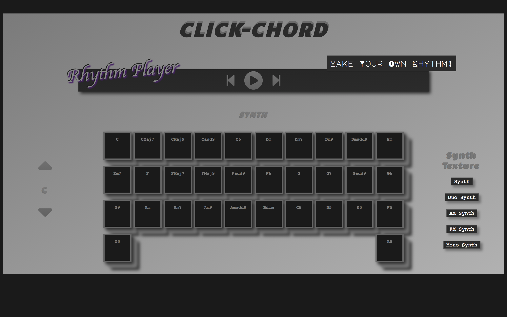
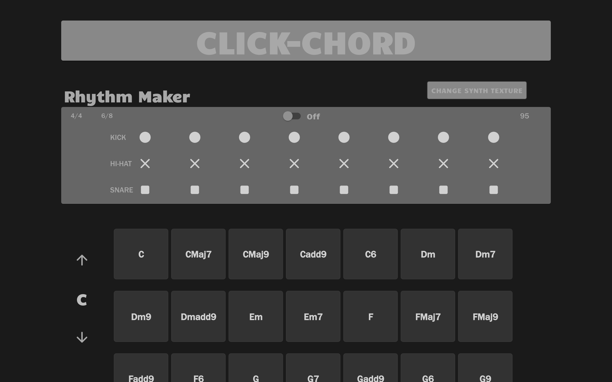

Recently, I revisited a project that a made one year earlier and refactored the entire thing.

The project is an called [Click-Chord](https://www.clickchord.com/). Essentially, the idea is to give the user an interface for making synth chord progressions and drum loops in the browser. The app relies heavily on Tone.js, a library that provides improvements upon and abstractions over the browser's native audio APIs.

The reason I built the app in the first place is that I'm naturally interested in front-end development, and I wanted to improve my ability to build a project that is visually and functionally faithful to a pre-built layout and design. I also just thought it would be a fun app to play with, and I had never seen anything like it in the browser.

The tools I leaned on to write and deploy Click-Chord include:

- React (`create-react-app`)
- Tone.js
- Materiual UI
- CSS Grid
- CSS Modules
- JSS
- Material-UI
- Netlify

## Why I Undertook a Refactor

When I set out to build Click-Chord, I couldn't find a precedent for what I wanted to build. That's what made the project such a rewarding endeavor. I had to be creative while finding solutions to the problems I was trying to solve.

But that also meant that my first iteration over the project was focused more on gettings things working than writing simple, scalable code. This was true especially of the layout, for which I had in mind a design that I was not willing to compromise on, even though I knew that mobile responsiveness was going to prove challenging.

What I wound up with when I first "finished" Click-Chord was a fun music inteface with a bunch of hard resizes for mobile and a palette of audacious colors without any regard to accessibility.

So, when refactoring Click-Chord, what I wanted to accomplish was the following:

- Make the layout responsive while keeping the code simple
- Make the design accessible in every way possible
- Make the design more user friendly generally

## CSS Grid: Make Anything At All Responsive

*By using CSS Grid, I was able to bring the lines of CSS that I wrote down from **659 to 355**.*

Of course, this could be because over the past year I've simply learned how to write smarter, more concise CSS. 

But much of that difference has to do with the fact that when you're using CSS Grid, you're writing far less media queries. The refactored code for Click-Chord uses 5 total media queries. The device for which I wrote one specifc, unique media query was the iPhone 5/SE, which is an outlier in terms of device aspect ratio.

Moreover, I could have gone without these media queries. The app would have been easily responsive using CSS Grid alone. But I wanted the app to be as accessible as possible, which meant using larger font sizes and larger clickable boxes in the app's interface. Rendering large fonts and components on smaller devices such as the iPhone 5/SE take's some specific adjustments.

## Accessibility: Making Your App Easier for Everyone to Use

I'm not a graphic designer, though I probably am more naturally interested in design than the average developer. I tend to obsess about my app's appearances, when I have the time.

The first iteratin of Click-Chord was a visual mess. I was shooting for an 80's, arcarde aesthetic, which I don't think was all that bad. But I didn't think much about font sizes, or the fact that I was using shades of colors that were a little too similar to be easily distinguished by everyone, including those with vision impairments. The title of the app also used a shadow effect that would make anyone feel dizzy.

In short, I got a little carried away with the design.

This time around, I chose one color palette and stored the color values in CSS variables, which I referenced globally.

This way, it was much easier for me to choose font and component colors and background colors in a way that created an appropriate amount of contrast.

A good way to test how easy your app is on the eyes is to look at it in grayscale. An extension that allows you to do this in Google Chrome is the [Dark Reader](https://chrome.google.com/webstore/detail/dark-reader/eimadpbcbfnmbkopoojfekhnkhdbieeh?hl=en-US) extension.

Here is the first iteration of Click-Chord in grayscale juxtaposed with the refactored Click-Chord.

## User Friendliness: It's About the Little Things

To try to provide a better user experience in Click-Chord, I relied heavily on the React library [Materiual-UI](https://material-ui.com/).

Material UI provides customizable React components that follow best UI and UX practice out of the box. For example, a Material-UI `<Button />` component will flash subtly in response to a user's click. This follows the best practice that every action your user is allowed to take provide some form of feedback. Your users shouldn't be left wondering whether or not your app is working.

Material-UI makes it easier and faster to add some really nice interfaces to your app's, like the `<Popover />` component that allows the user to change the synth texture in Click-Chord.

Honestly, though, a lot of companies use Material-UI to develop their applications, so it's a useful library to get familiar with. Even if your company doesn't use the library, using it in your free time will make you mindful of best practices in front-end development.

Also, customizing Material-UI components is a good opportunity to learn JSS, since the Material-UI component library comes with the JSS dependency built in. There are other ways of adding custom styles to MUI components, but JSS is perhaps the most common way. Since JSS is something I use at my day job, I wanted to use it in Click-Chord so that I could gain a better understanding of it.

## Conclusion: Follow Your Curiosity

I built Click-Chord because I like exploring the relationship between computers and music. While working on the app has at times been frustrating, as any development is occasionally, it hasn't exactly felt like work.

If you're looking to grow your development skills in a particular area, I couldn't recommend more that you choose a topic that you're naturally curious about, and then try to bring something new into existence within that sphere of your interests.

