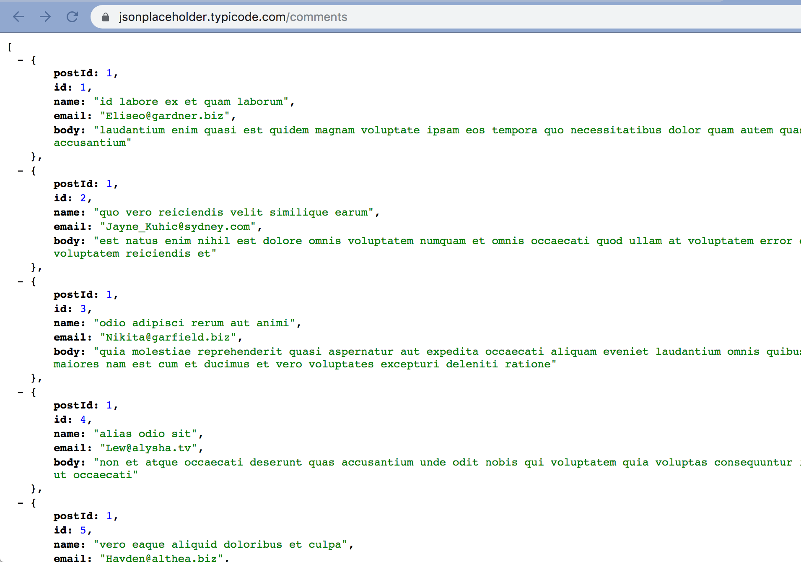
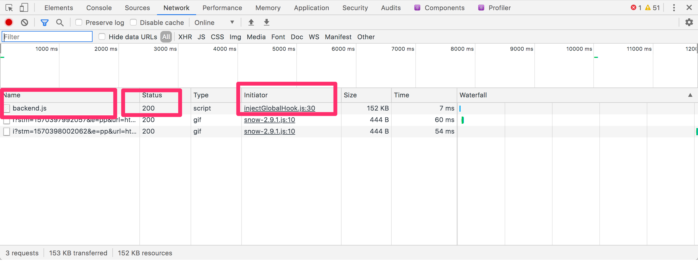

In my first year as a professional software developer, I'm learning that one of the most common and important parts of this job is debugging.

Debugging is a part of your development skillset that's easy to overlook as a beginner, because when you're just starting out, the projects that you're working on tend not to be very complex. Therefore, it's often easy to track down bugs in a somewhat crude way, without using the tools available. As long as your projects are small in scope, debugging in this way might not waste too much time.

When you start working on a production application containing years worth of code and layers of complexity, however, debugging by brute force and raw trial-and-error just won't do. You'll waste lots of time. You'll grow frustrated. You'll run out of guesses about where the root of your problem lies.

And when you reach this point of frustration (which you definitely will, over and over again, as a new developer), your more experienced colleagues will point you to your debugging tools.

## Some Good Debugging Habbits to Cultivate

The debugging tools you use will depend on your development environment (the language and framework you're using, your IDE, etc.), but the debugging techniques that you develop will be useful regardless of any particulars.

With that in mind, I'd like to offer some general approaches to debugging that I've picked up on the job so far:

### Make Your Data Visible

There's no reason to guess about what data your components are interacting with. At the very least you log to the browser console the data rendered out in your front end components.

What I've found most helpful, though, is to trackdown the endpoints that my front end components are interacting with and then use those endpoints in an isolated environment where I can see the data visibly. You can use an app like [Postman](https://www.getpostman.com/) to test the results of different CRUD operations on your endpoints. 

If you just want a quick way to read the data fetched by hitting your endpoints, you can get a browser plug-in that renders human-readable JSON (I like [JSONView](https://chrome.google.com/webstore/detail/jsonview/gmegofmjomhknnokphhckolhcffdaihd?hl=en)) and simply hit the endpoint in your browser's URL bar. 

This way, while you're working on a HTML component that renders out part or all of this data, you don't have to maintain a mental model of the data; you can simply reference the JSON. This eliminates the likelihood of bugs stemming from a failure to remember the shape of the data, or from typos while referencing the data.

### Use the Network Tab

If you want to track down calls to an endpoint, data received from an endpoint call, or error responses from an endpoint call, the Network tab in your browser's developer tools is most definitely your friend. 

This tab will tell you which endpoints are being hit from a given page, the response status of the API call, and even which part of your code is making the API call, among other things.

This removes a lot of guess work. When the code behind your front end view fails to fetch or post data, or fails to render in the way you think it should, just pop open your network tab and look at the endpoint interactions taking place over the wire.

### Place Strategic Breakpoints

The IDE you're using, and good browser developer tools, will let you place breakpoints throughout your code so that you can see the data being manipulated at any given location during execution.

It's worthwhile to get familiar with the information you can derive from a well-placed break statement.

For example, if you're wondering why you're getting a failure response from a certain endpoint, you can run the code for that endpoint in debugger mode after placing breakpoint that allow you to see the local variables. A lot of times, what you find out in a situation like this, is that your endpoint is receiving incorrect parameters, or that something is happening with the paramaters before the return statement that is causing your endpoint's action to breakdown prematurely.

These are just a few thoughts on debugging approaches. They're fresh in my mind because they've been reenforced to me often in my early software development journey.

## Conclusion: Remove the Guesswork

The thread I see that runs throughout all of the guidance I've received about debugging is that you want to remove as much guesswork as you can. Make your data visible. Read the error messages and go where they lead you. 

This sounds simple, and it is. But it's necessary to remind yourself of the power of debugging, because it's tempting to run into an error and think to yourself, "Oh, I've seen something like this before. I've got an idea..." And maybe your idea is the solution.

But maybe it's not. And then you try the next idea. Then the next one. 

Don't go far down that road. 

Let the computer do what it does best. Give it some input and let it show you the output. And then update your code accordingly.