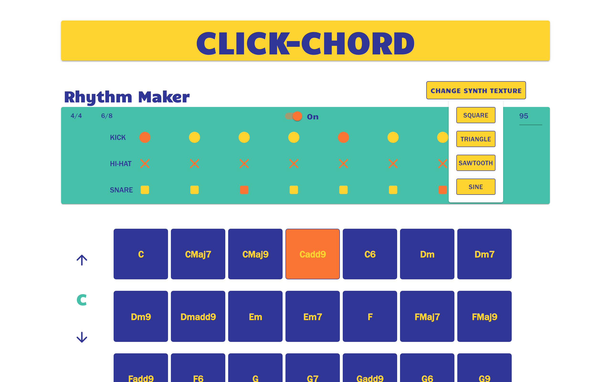

##Personal Projects

###Click-Chord

**DEPLOYED AT:** <https://www.clickchord.com/>

**GITHUB REPOSITORY:** <https://github.com/rmajuri/click-chord>

**TECH USED:** Tone.js, React, JavaScript, Materiual UI, CSS Modules, JSS, Netlify

Click-Chord is an app that allows users to build synthesizer chord progressions by clicking boxes. Each box, when clicked, triggers a different chord within its respective major scale. Users can build chord progressions in any key they like.

In addition to building chord progressions, users can also build drum their own drum loops to accompany their compositions.

Read more about how Click-Chord was made in the README of the project's Github repo (find the URL above).

---

###Philly Bike Finder

**DEPLOYED AT:** <https://philly-bike-finder.herokuapp.com/>

**GITHUB REPOSITORY:** <https://github.com/rmajuri/philly-bike-finder>

**TECH USED:** JavaScript, jQuery, HTML, CSS, Node, Express, Webpack

Indego is Philadelphia's bike-sharing program. Using the Philly Bike Finder app, users can find the Indego bike stations closest to where they are currently located. Clickable map markers trigger windows that tell users how many bikes and parking docks are available at each station.

---

###trademarkit™

**DEPLOYED AT:** <https://trademarkit.herokuapp.com/>

**GITHUB REPOSITORY:** <https://github.com/rmajuri/trademarkit>

**TECH USED:** React, Node.js, Razzle, Material-UI

**API USED:** https://markerapi.com/

trademarkit™ is an app where you can search for brand names, or "wordmarks", in order to find information about the name's past and current usage. Search results show the user a description of the company or product that the trademarked name represents, along with information regarding the entitity that owns the trademark, the city and state where the owner is located, and the status of the trademark (whether it is dead or active).

---

###DIGI-TAILS Product Request App

**DEPLOYED AT:** <https://github.com/rmajuri/request>

**TECH USED:** React, Gatsby, PostgreSQL, Sequelize.js, Sass, Bootstrap/React-Bootstrap, Formik & Yup

DIGI-TAILS makes fully sequential digital LED tail light kits for classic cars. Popular demand dictates what products they add to their collection.

Still in progress, the DIGI-TAILS Product Request App will allow users to request a tail lights for a vehcile of a particular year, make, and model. Careful form validation ensures accurate and meaningful requests.

The next step in the project is to build a dashboard where the app's administrators can see the request data organized in a meaningful manner.

---

###Catify

**DEMO:** <https://www.youtube.com/watch?v=RogIJkblx04>

**GITHUB REPOSITORY:** <https://github.com/rmajuri/indego-bike-pulse>

**TECH USED:** React Native, Redux, Firebase

I collaborated with three other developers to create a mobile messaging app called Catify. To build this app, we used React Native and the Expo.io toolchain. Among my particular contributions to the project were developing the UI, architecting the navigation, and integrating Redux.
